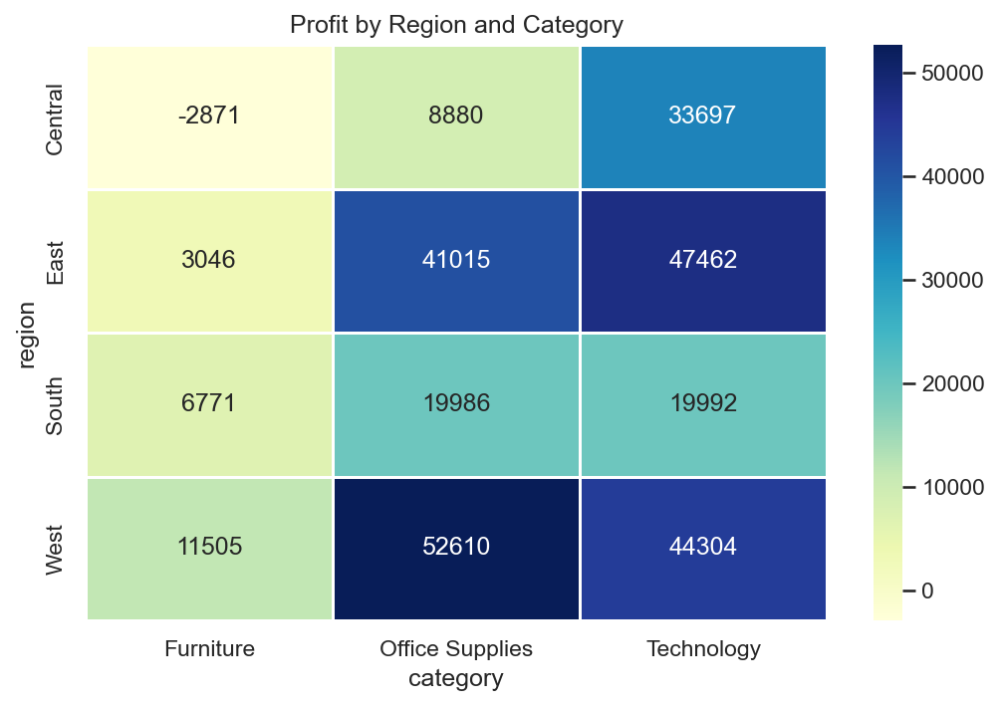
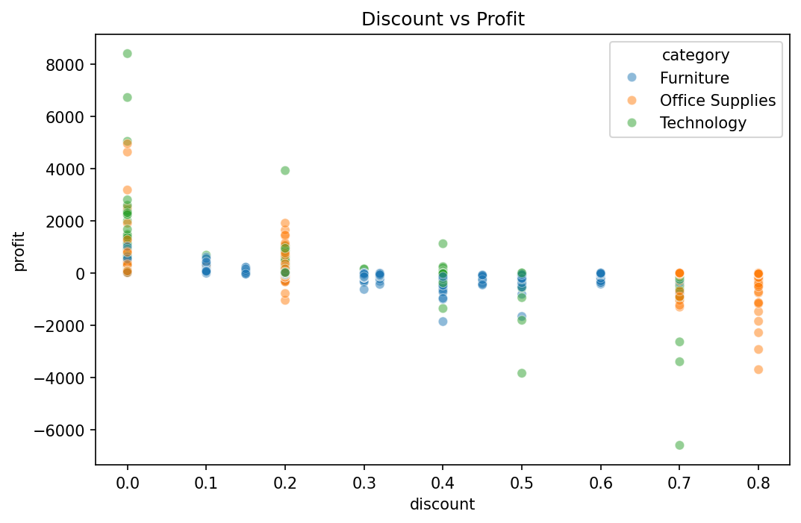
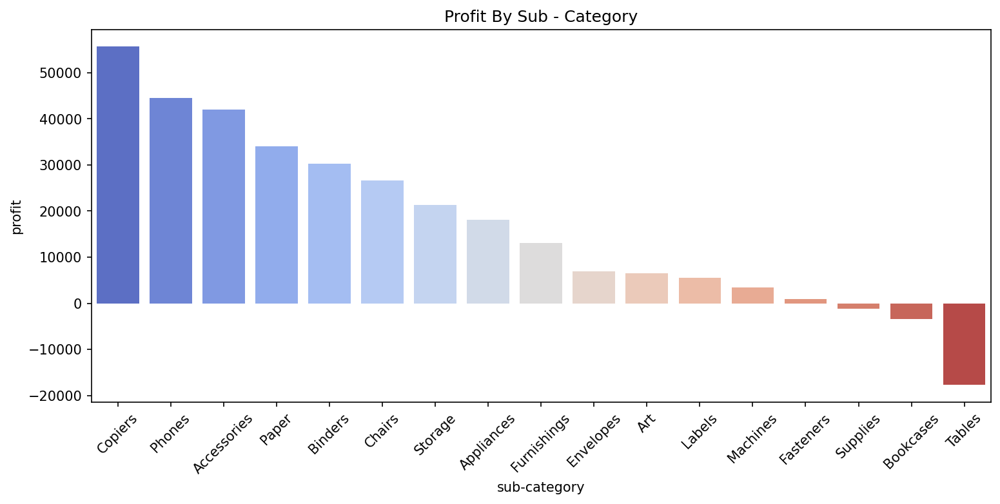
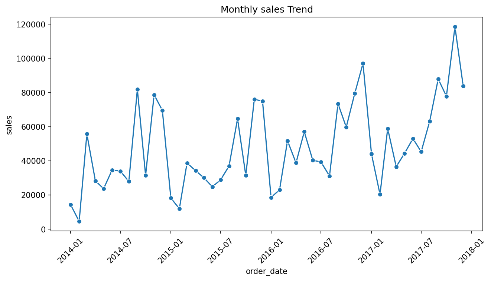

# 📊 Superstore Sales EDA

End-to-end Exploratory Data Analysis on Kaggle's Sample Superstore dataset.
Answered 5 key business questions covering profitability, regional performance,
discount impact, shipping behavior, and seasonality.

---

## 📁 Project Structure

notebooks/
├── 01_data_cleaning.ipynb
├── 02_eda_sales_profit.ipynb
├── 03_eda_region_time.ipynb
├── 04_eda_subcategory_discount.ipynb
├── 05_customer_segment.ipynb
├── 06_advanced_insights.ipynb
└── 07_business_report.ipynb

visuals/ → all chart PNGs

---

## 📊 Key Visualizations

### Profit by Region and Category

### Discount vs Profit

### Profit by Sub-Category

### Monthly Sales Trend

---

## 🔍 5 Business Questions Answered

| # | Question | Answer |
|---|---|---|
| 1 | Which category is most profitable? | Technology (17% margin) |
| 2 | Which region performs best? | West region leads in profit |
| 3 | What shipping mode is preferred? | Standard Class (60% of orders) |
| 4 | Does discounting hurt profit? | Yes — losses start above 30% discount |
| 5 | Which sub-categories are loss-making? | Tables (-$17.7K) and Bookcases (-$3.4K) |

---

## 💡 Key Findings

- Technology leads with ~17% profit margin. Furniture barely makes 2%.
- Central + Furniture is the only region-category combination losing money (-$2,871).
- Discounts above 30% consistently turn profitable orders into losses.
- Canon imageCLASS 2200 Copier alone contributes ~$25K profit — the top single product.
- Sales spike every November — strong year-end seasonality pattern.

---

## 🛠️ Tools & Libraries

Python 3 · pandas · numpy · matplotlib · seaborn · Jupyter Notebook

---

## 📌 Dataset

[Sample Superstore — Kaggle](https://www.kaggle.com/datasets/vivek468/superstore-dataset-final)  
9,994 rows · 21 columns · 2014–2017
